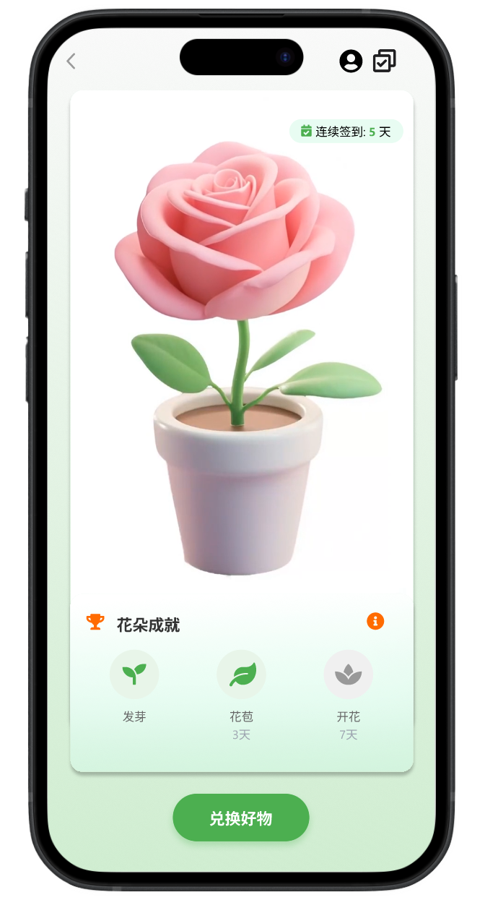
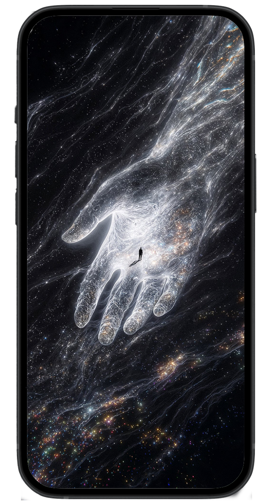
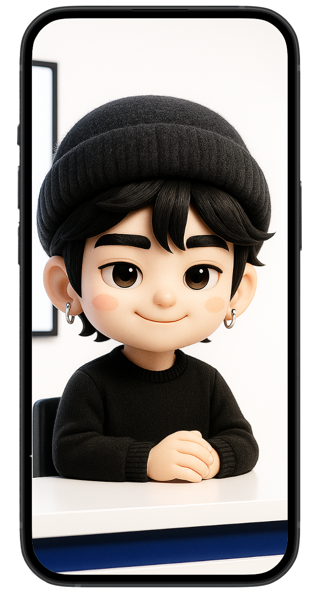

# portfolio01
# 我的作品集

欢迎来到我的个人作品集！这里展示了我在 AI 应用、前端开发和交互设计方面的实践项目。

---

## 📂 目录导航
- [首页](#首页)
- [项目 1 - 不背单词积分商城](#1-不背单词积分商城)
- [项目 2 - AI 星座占卜](#2-ai-星座占卜)
- [项目 3 - AI 新闻助手](#3-ai-新闻助手)
- [资源目录](#资源目录)

---

## 🏠 首页
- 文件：`index.html`  
- 功能：作品集首页，展示三个项目概览。  

---

## 1️⃣ 不背单词积分商城

- 文件：`project1.html`
- 简介：利用 AI 编码搭建，实现植物养成 + 积分兑换的学习激励系统。
- 视频演示（可选）：`assets/videos/project1-demo.mp4`
- [查看详情](project1.html)

---

## 2️⃣ AI 星座占卜

- 文件：`project2.html`
- 简介：基于大模型的 AI 客服，提供趣味性星座运势解读与互动问答。
- 视频演示（可选）：`assets/videos/project2-demo.mp4`
- [查看详情](project2.html)

---

## 3️⃣ AI 新闻助手

- 文件：`project3.html`
- 简介：通过智能体获取实时新闻资讯，自动筛选并推送每日热点。
- 视频演示（可选）：`assets/videos/project3-demo.mp4`
- [查看详情](project3.html)

---

## 📁 资源目录
